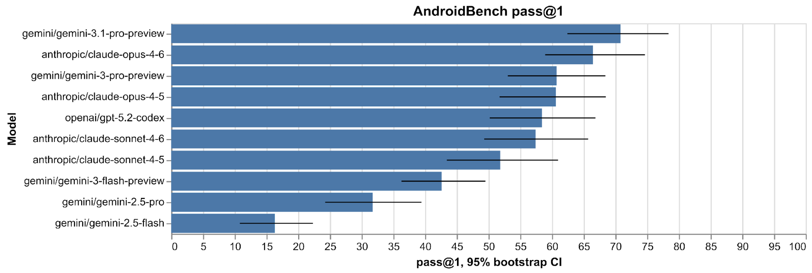
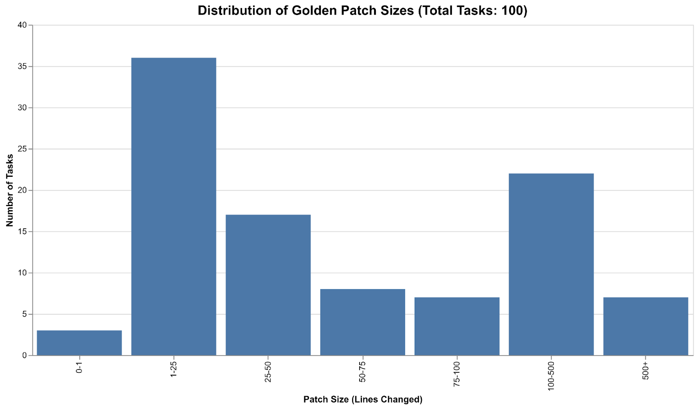
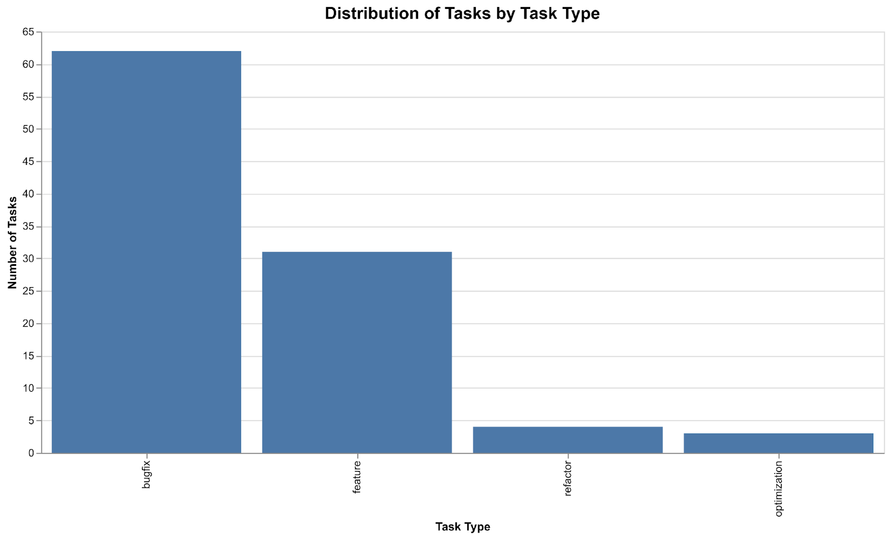
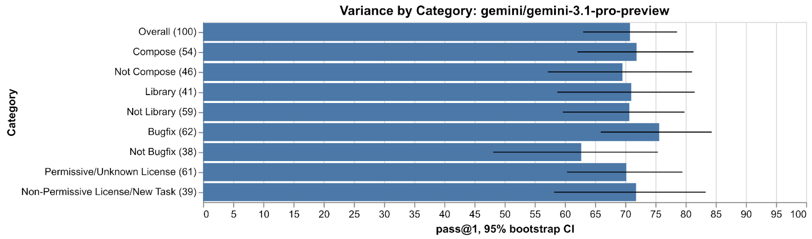
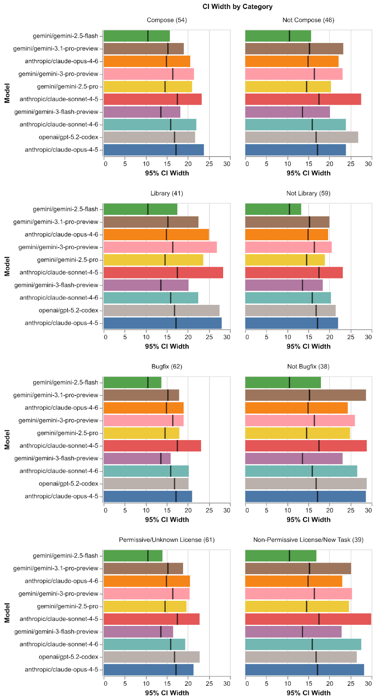
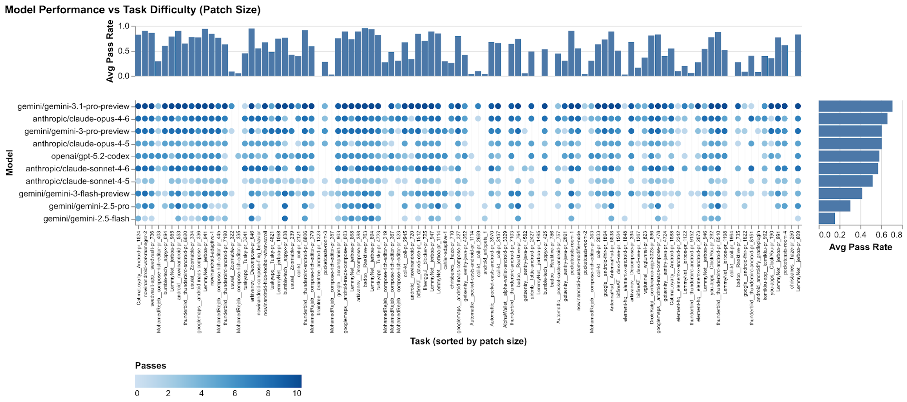
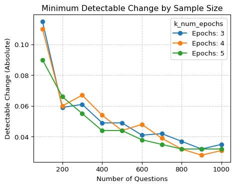

# Android Bench Technical Report
2026-02-25

Android Bench is a dataset of 100 tasks that are representative of the kinds of
tasks that Android application developers perform day to day. The benchmark
follows the structure of [SWE-Bench](https://www.swebench.com/) - given a task
in the context of a git repository, we evaluate how well an agent can complete
the task. We are sharing this dataset to (a) give Android developers a view into
how well current products perform on Android tasks, and (b) help agent and LLM
developers to improve their products for Android.

The public release of Android Bench includes the official website, a
methodology document, a blog post, and a GitHub repository containing the
dataset and evaluation harness.

## Summary of Results

 pass@1

| ⚠️  Warning |
| :---- |
| Note: GPT 5.2 Codex was run with reasoning level high (and not xhigh). Codex at xhigh does not complete the benchmark in 2 days. |

The latest models - Gemini 3.1 Pro and Claude Opus 4.6 - top the leaderboard.
Note however that the 95% confidence intervals overlap across many models. So
this version of the dataset only conclusively shows that newer generation models
are significantly better than older generation models.

## Android Bench vs SWE-Bench

SWE-Bench tests general software engineering capabilities. Android Bench tests
additional Android specific capabilities:

*   Focuses on Kotlin language and Android APIs as opposed to Python.
*   Requires understanding and use of the gradle build system.
*   Multi-modal: *20* tasks include screenshots that need to be understood in
    order to complete the task. (Future editions will include videos
    demonstrating issues with animations).
*   Heavily exercise Android’s ever evolving API landscape: All the tasks
    require knowledge of some area of Android.
*   Android projects tend to be much larger, spanning multiple code files and
    many thousands of lines of code.

## Dataset Construction

### Task Acquisition

See the Android Bench Methodology for a detailed description on the task acquisition pipeline.
At a high level, there are two sources of tasks:

*   12 tasks are entirely new tasks manually written by Android domain experts,
    specifically targeting critical areas of Android that were not represented
    in the GitHub data.
*   The remaining 88 tasks are collected from existing PRs on GitHub.

The GitHub data collection process undergoes a stringent review pipeline:

1. We only include tasks from repositories with at least 500 GitHub stargazers
(stars used as an approximation of popularity/quality), and only include changes
from the last 3 years.

2. These tasks are then vetted by our team to validate that the test coverage of
the task is reasonable.

3. It is then further vetted by a team of engineers who are proficient in
Android app development to check whether the task description is clear, and
whether the tests are correctly specified.

### Dataset Composition

We measure the task difficulty by the number of lines of change that were
required in the human authored patch. Android Bench includes 29 tasks that
require at least more than 100 lines to be changed.



Tasks are sourced from 33 repositories. The repositories that contribute the
most tasks are:

| repository | count |
| :---- | :---- |
| LemmyNet/jerboa | 13 |
| MohamedRejeb/compose-rich-editor | 9 |
| Automattic/pocket-casts-android | 7 |
| android/nowinandroid | 7 |
| thunderbird/thunderbird-android | 7 |
| coil-kt/coil | 6 |
| getsentry/sentry-java | 4 |
| badoo/Reaktive | 4 |
| googlemaps/android-maps-compose | 4 |
| element-hq/element-x-android | 3 |

Tasks were picked to cover a variety of domains in Android APIs. The following
chart shows the distribution of the various domains.


We can also categorize the dataset by the type of task.



### Contamination risk

The current datasetn is comprised of tasks that are newly created, and tasks that
are minimally modified from what is present on GitHub. The current distribution
looks like this:

| category | count |
| :---- | :---- |
| Permissive or Unknown License | 61 |
| Non Permissive Licenses (GPL, AGPL) | 27 |
| New Task | 12 |

There is a real possibility that LLMs are trained on GitHub data from
permissively licensed projects, so there is a definite risk of contamination.
Future editions of Android Bench will attempt to reduce the chances of this by
utilizing some of the following techniques:

*   Increasing the proportion of newly created tasks that are not present on
    GitHub.
*   Not open sourcing the dataset on GitHub (e.g. providing the dataset only on
    HuggingFace, or by keeping the dataset private and only allowing runs via
    Kaggle)

As of right now, the results do not seem to vary significantly between the
permissive and non permissive projects.

## Experimental Methodology

In the first release of the benchmark, we use a single agent harness, and
benchmark multiple models. The agent harness is a simple shell agent that has
been proven to work well on SWE-bench. We mainly target the latest versions of
the models from Anthropic, Google and OpenAI.

We run the benchmark 5 times on each model, and report pass@1 metric, with CI
calculated using the bootstrap method. We set a limit of **10.0 dollars** for the
inference cost and **250 turns** for the number of turns utilized to solve a single task.

### Agent Harness

Android Bench uses [mini-swe-agent
v1](https://GitHub.com/SWE-agent/mini-swe-agent) as its agent harness. This is a
simple shell agent used in [SWE-Bench](https://www.swebench.com/). It performs
well on SWE-bench, with Gemini 3 Pro scoring 75% on SWE-bench verified with this
agent according to their website.

The system instruction is slightly customized to indicate that the agent is
solving an Android related task:

```text
<instructions>
# Task Instructions

## Overview
You're an Android software engineer interacting continuously with a computer by submitting commands.
You'll be helping implement necessary changes to meet requirements in the PR description.
Your task is specifically to make changes to non-test files in the current directory in order to fix the issue
described in the PR description in a way that is general and consistent with the codebase.

IMPORTANT: This is an interactive process where you will think and issue ONE command, see its result, then
think and issue your next command.

For each response:
1.  Include a THOUGHT section explaining your reasoning and what you're trying to accomplish
2.  Provide exactly ONE bash command to execute

## Important Boundaries
-   MODIFY: Regular source code files in /workspace/testbed (this is the working directory for all your subsequent commands)
-   DO NOT MODIFY: Tests, configuration files (pyproject.toml, setup.cfg, etc.)

## Recommended Workflow
1.  Analyze the codebase by finding and reading relevant files
2.  Create a script to reproduce the issue
3.  Edit the source code to resolve the issue
4.  Verify your fix works by running your script again
5.  Ensure there are no build errors by building the project with gradlew assembleDebug
6.  Test edge cases to ensure your fix is robust
7.  You can ignore build errors related to formatting or dependency guards. Just focus on code changes.

## Command Execution Rules
You are operating in an environment where
1.  You write a single command
2.  The system executes that command in a subshell
3.  You see the result
4.  You write your next command

Each response should include:
1.  A **THOUGHT** section where you explain your reasoning and plan
2.  A single bash code block with your command

Format your responses like this:

<format_example>
THOUGHT: Here I explain my reasoning process, analysis of the current situation,
and what I'm trying to accomplish with the command below.

'''bash
your_command_here
'''
</format_example>

Commands must be specified in a single bash code block:

'''bash
your_command_here
'''
```

Future versions of Android Bench will benchmark utilizing multiple agent
harnesses including gemini-cli, Android Studio’s agent, Claude Code, and Codex.

### Detailed Results

The following table breaks down model performance across different subsets of
the dataset. Since the overall dataset contains only 100 tasks, variance of
really fine grained subsets isn’t very interesting to see.

Instead, we look at the dataset split by a few categories and their negations. 
In particular, we look at the following subsets:

*   Compose vs non Compose. Compose is the current UI toolkit library used in
    Android apps.
*   Library vs Application: 41 tasks come from GitHub projects that are
    considered as libraries to be utilized in other apps. The other 59 tasks
    correspond to apps in various categories.
*   Bugfix vs others (e.g. feature requests).
*   Permissive licenses (potentially contaminated) vs non permissively licensed.

The following table shows the pass rate and the 95% CI bounds for each of these
categories for all the models. The graphs below show a visual representation of
the same data.

| model\_name | Overall (100) | Compose (54) | Not Compose (46) | Library (41) | Not Library (59) | Bugfix (62) | Not Bugfix (38) | Permissive/Unknown License (61) | Non-Permissive License/New Task (39) |
| :---- | :---- | :---- | :---- | :---- | :---- | :---- | :---- | :---- | :---- |
| gemini/gemini-3.1-pro-preview | 70.8 (63.4, 78.1) | 71.9 (61.5, 81.3) | 69.6 (57.6, 81.7) | 71.0 (59.0, 81.8) | 70.7 (60.3, 80.8) | 75.6 (65.8, 83.4) | 62.7 (50.5, 75.9) | 70.2 (59.5, 79.5) | 71.8 (59.7, 83.1) |
| anthropic/claude-opus-4-6 | 66.4 (59.0, 74.1) | 65.9 (55.8, 76.6) | 67.0 (55.2, 78.3) | 61.6 (49.1, 73.8) | 69.8 (59.5, 79.1) | 71.3 (61.6, 80.2) | 58.5 (46.0, 70.7) | 63.9 (53.3, 74.0) | 70.4 (58.8, 81.1) |
| gemini/gemini-3-pro-preview | 60.7 (53.3, 68.2) | 63.9 (53.3, 74.5) | 57.1 (44.8, 69.0) | 56.9 (44.4, 69.7) | 63.3 (53.2, 72.7) | 65.5 (55.6, 75.2) | 52.7 (38.5, 66.2) | 57.5 (47.3, 67.5) | 65.7 (52.9, 78.2) |
| anthropic/claude-opus-4-5 | 60.6 (51.7, 69.5) | 59.2 (46.8, 70.9) | 62.2 (50.4, 73.0) | 51.0 (37.0, 65.0) | 67.1 (55.3, 78.0) | 67.4 (56.1, 77.4) | 49.2 (35.1, 62.7) | 56.7 (45.3, 67.3) | 66.7 (52.8, 80.5) |
| openai/gpt-5.2-codex | 58.4 (49.8, 67.3) | 61.9 (50.6, 72.0) | 54.3 (42.0, 67.0) | 61.3 (48.3, 74.2) | 56.5 (45.5, 68.4) | 63.4 (53.2, 73.7) | 50.0 (36.9, 64.0) | 57.8 (48.1, 68.6) | 59.4 (46.2, 72.2) |
| anthropic/claude-sonnet-4-6 | 57.4 (48.9, 65.3) | 59.5 (48.5, 71.3) | 54.9 (42.4, 65.8) | 50.3 (37.7, 62.2) | 62.3 (50.8, 72.7) | 61.4 (51.3, 71.0) | 50.8 (36.2, 64.7) | 54.1 (43.7, 64.0) | 62.5 (48.7, 75.3) |
| anthropic/claude-sonnet-4-5 | 51.9 (42.8, 60.9) | 54.1 (40.9, 66.1) | 49.3 (36.2, 61.6) | 45.8 (32.5, 58.4) | 55.9 (44.1, 67.2) | 55.9 (44.6, 66.7) | 45.0 (29.7, 60.4) | 50.0 (38.3, 61.7) | 54.7 (39.3, 69.2) |
| gemini/gemini-3-flash-preview | 42.6 (35.8, 49.6) | 43.3 (35.4, 52.8) | 41.8 (32.2, 51.6) | 35.4 (25.2, 45.9) | 47.5 (38.4, 56.1) | 44.8 (37.0, 52.3) | 38.9 (26.7, 50.5) | 39.3 (31.2, 47.6) | 47.7 (36.1, 59.0) |
| gemini/gemini-2.5-pro | 31.7 (24.5, 39.4) | 32.5 (21.9, 42.9) | 30.9 (20.9, 41.6) | 27.1 (15.7, 39.7) | 34.9 (25.8, 44.2) | 34.4 (25.1, 43.8) | 27.3 (16.2, 40.3) | 29.5 (20.8, 39.3) | 35.2 (24.8, 46.9) |
| gemini/gemini-2.5-flash | 16.3 (11.2, 22.2) | 17.8 (10.4, 26.4) | 14.5 (7.3, 22.7) | 15.8 (7.0, 24.8) | 16.7 (10.0, 23.7) | 18.0 (11.8, 25.3) | 13.5 (4.9, 22.9) | 14.3 (8.4, 21.0) | 19.4 (10.7, 28.0) |

The following graph visualizes the above data for gemini/gemini-3.1-pro-preview:


The following graph plots just the width of the confidence intervals by each of
the categories. The header shows the number of tasks in those categories. The
mark inside the bar reflects the width of the overall CI. Since all of these are
categories include only a subset of the data, the corresponding CI is always
longer than the overall CI width for a given model.



#### Task Difficulty

Patch size is not a perfect measure of task difficulty, but the following is a
scatter plot that shows how often a model solves a specific test. On the x axis,
we have tasks sorted by the size of their original patch.



### Trajectory Analysis

#### Gemini Flash 3.0

Our results show Flash 3.0 underperforming compared with other coding
benchmarks, we performed trajectory analysis to determine possible reasons why.
Based on the analysis of the 16 tasks from the nowinandroid repository across
all models, here are the common patterns and divergences identified.

##### The `sed` Loop (Tooling Deficit)

Gemini 2.5 Flash, Pro and Gemini 3.0 Flash often get stuck in a “sed loop”.
Models rely on sed for code edits but lack the regex precision to handle
multi-line Kotlin structures. When a sed command fails, models enter a “Repair
Loop” rather than pivoting. Flash is particularly prone to this mistake. Each
generation of Gemini models use sed less than the previous generation, and this
seems to lead to better results. Gemini 3.1 Pro and Claude bypass sed almost
entirely by writing Python scripts to perform safe string replacements.

##### Validation Failure

Flash 3.0 is often over-confident in it’s solution: It immediately considers the
job done and submits the task after an edit without a verification step.
Successful models run `./gradlew` or test and use the compiler errors to iterate.

##### Context Loss

While Pro models successfully trace variable and state flows across multiple
files, Flash often loses the connective thread. It frequently attempts isolated,
localized fixes, hallucinating variable availability or ignoring required
structural dependencies in adjacent files. For example, in one trajectory from
`MohamedRejeb\_\_compose-rich-editor-pr\_319`, Flash attempts to modify a complex
state management file (`RichTextState.kt`).

Because it fails to comprehend the
outer class structure and bracket alignment, its sed replacement injects
top-level methods inside of an existing function scope.

Since Flash
hallucinated the boundary of the class, the compiler throws scoping errors.
Flash completely loses track of previously available variables and methods in
the resulting repair loop. Instead of stepping back to read the file structure
and fix the bracket alignment, Flash gets trapped in this localized context,
attempting to fix “Unresolved reference” errors by adding new sed commands.

## Appendix: Run Statistics

All the data in this report was generated from the following benchmark runs. The
dataset was run multiple times for each model (see num\_runs column in the
table).

> Note: Currently the numbers are less than 100 because a few tasks have been
changed after review and their results are not included.

| model\_name | num\_runs | avg\_tasks |
| :---- | :---- | :---- |
| gemini/gemini-3.1-pro-preview | 10 | 99.000 |
| anthropic/claude-opus-4-5 | 5 | 99.000 |
| anthropic/claude-opus-4-6 | 8 | 99.375 |
| anthropic/claude-sonnet-4-5 | 3 | 99.000 |
| anthropic/claude-sonnet-4-6 | 8 | 99.000 |
| gemini/gemini-2.5-flash | 8 | 97.750 |
| gemini/gemini-2.5-pro | 8 | 95.125 |
| gemini/gemini-3-flash-preview | 8 | 96.750 |
| gemini/gemini-3-pro-preview | 8 | 99.000 |
| openai/gpt-5.2-codex | 6 | 99.000 |

## Appendix: Metrics

### pass@1 Metric

The pass@1 metric measures the probability that a single generated solution to a
problem will successfully pass all associated unit tests. It acts as an unbiased
estimator of the model’s “first-try success rate.” The pass@1 metric is
calculated as the number of problems that pass all unit tests divided by the
total number of problems. The benchmark was run for a minimum of 5 runs per
model. For a specific problem, if a model generates n total solutions and c of
those solutions pass the tests, the probability of success for that problem is
calculated as:


### 95% Confidence Interval via Hierarchical Bootstrapping

The 95% CI intervals were computed by using the following algorithm:

1.  Randomly sample (with replacement) 100 problems from the dataset
2.  For each drawn problem, bring along all of its original n results.
3.  From those n results, sample (with replacement) a new set of n results.
4.  Compute the overall pass@1 average for this newly generated simulation of
    100 problems.
5.  Repeat steps 1–3 for 1000 iterations to create a distribution of 1,000
    simulated averages.
6.  Sort the 1,000 simulated averages in ascending order, from lowest to
    highest.
7.  Isolate the middle 95% of the data by trimming the extreme 5% (2.5% from
    each end) to get the lower and upper bounds.

For a detailed analysis of this approach, refer to standard literature on
Cluster Bootstrap Confidence Intervals.

## Appendix: Statistical Significance of difference between models

## Appendix: Analysis of Variance

### Variance Contributed by Task vs. Runs

To quantify the drivers of performance fluctuation, we employed a dual-bootstrap
variance analysis. Total Variance Bootstrap: We performed a nested resampling of
both tasks and runs. By sampling tasks with replacement and then sampling runs
within those tasks, we captured the full spectrum of uncertainty. Run-Only
Variance Bootstrap: We fixed the set of tasks and only resampled the runs. This
isolated the ‘noise’—the variance specifically caused by model inconsistency
across identical inputs. While most models show that their performance variance
is dictated by the specific tasks assigned, Gemini 3 Flash is a notable outlier.
A much larger portion of its variance is explained by the runs, indicating that
its performance fluctuations are driven by inherent run instability. This
suggests that while other models are consistently challenged by specific tasks,
Gemini 3 Flash’s results are significantly more susceptible to stochastic
‘noise’ or inconsistent execution across identical prompts.

### Power Analysis

We used the Empirical Quantile method to estimate the detectable change for each
sample size (\# tasks, \# runs). The results show that our current benchmark can
only detect an absolute pass rate difference of \~10%. To increase power, we
should add more tasks.



### Stability Score

Stability is quantified by the formula , where S ∈ [0,1]. This metric
captures the degree of consensus across multiple trials of the same task. Our
current benchmark average of 0.85 reflects a generally stable performance across
the suite. However, because this metric is highly sensitive to outliers in small
sample sizes, we treat it as an initial signal to identify and deep-dive into
potentially unstable model configurations or problematic task definitions.

| model\_name | stability\_score |
| :---- | :---- |
| anthropic/claude-opus-4-5 | 0.838384 |
| anthropic/claude-sonnet-4-5 | 0.831566 |
| gemini/gemini-3.1-pro-preview | 0.812121 |
| gemini/gemini-2.5-flash | 0.784170 |
| openai/gpt-5.2-codex | 0.781141 |
| gemini/gemini-3-pro-preview | 0.770202 |
| anthropic/claude-opus-4-6 | 0.753930 |
| anthropic/claude-sonnet-4-6 | 0.740000 |
| gemini/gemini-2.5-pro | 0.726061 |
| gemini/gemini-3-flash-preview | 0.565051 |

## Appendix: Example Tasks

### you-apps\_\_ClockYou-pr\_292
```text
Relatively simple sounding error that to fix requires migrating a Room database

*   https://GitHub.com/you-apps/ClockYou/pull/292
*   Description:

\# 282: App crashes after adding two cities with the same name \#\#\# Steps to
reproduce

Add two cities with the same name to the world clock (e.g., Abidjan/Burkina Faso
and Abidjan/Bouvet Island)

\#\#\# Expected behavior

Two cities are added to the world clock.

\#\#\# Actual behavior

The app crashes.

\#\#\# Clock You version

7.0

\#\#\# Android version

Android 13

\#\#\# Other details

\#\#\# Acknowledgements

\- \[X\] I have searched the existing issues and this is a new ticket,
\*\*NOT\*\* a duplicate or related to another open issue. \- \[X\] I have
written a short but informative title. \- \[X\] I will fill out all of the
requested information in this form.
```

### Android\_snippets\_1
```text
Project starts in a state that doesn’t build Simple sounding update cascades
into multiple version upgrades. JDK, AGP, Kotlin, KSP and Hilt. \# \[Snippets\]
Upgrade to JDK 25 and Kotlin 2.3.0

\#\# Description When using JDK 25 to build the project, the project fails to
build. In order to support this we will also have to upgrade to Kotlin 2.3.0
```
### LemmyNet\_\_jerboa-pr\_1485
```text
Migrate to Compose BOM
https://developer.android.com/develop/ui/compose/setup\#using-the-bom \# 1484:
Migrate to Compose BOM

https://developer.android.com/develop/ui/compose/setup\#using-the-bom
```